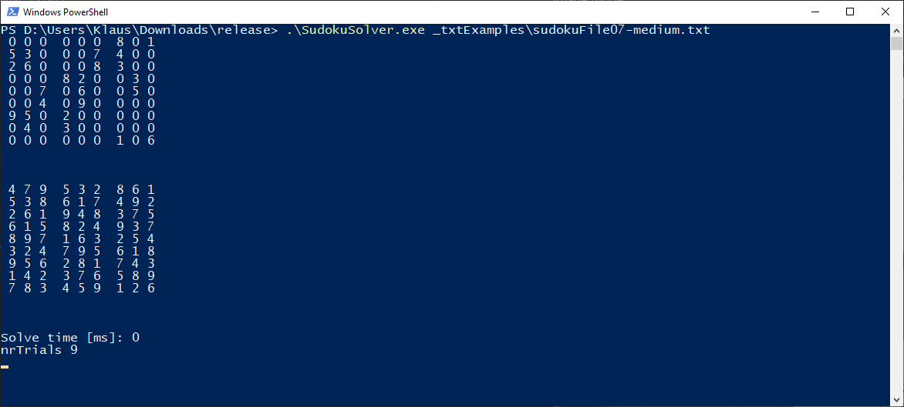
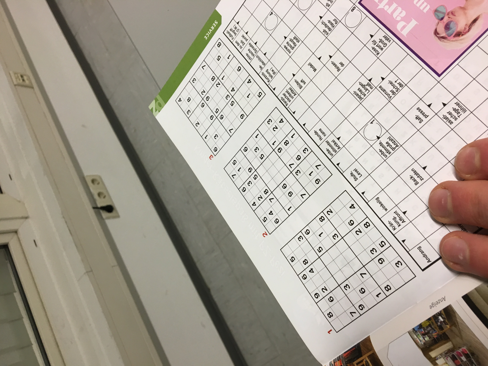

# Sudoku Solver in C++

## How it works

The project uses:

* https://github.com/opencv/opencv
* https://github.com/tesseract-ocr/

## Requirements

* Windows with c++ runtime

## How to use

Execute the following command in the commandline to startup the project.

``.\SudokuSolver.exe .\_imgExamples\sudoku1.jpg``

The first parameter is the path to the image or the text file.

The software can be run in two different modes:
* Image mode (.jpg)
* Text mode (.txt)

### Image mode

``.\SudokuSolver.exe .\_imgExamples\sudoku1.jpg``

Use the mouse to select the ROI (region of interest) / Sudoku on the image:


Hit the right mouse button to clear the current selection.
Hit ``Enter`` to confirm and to start the analysis.


The solution is drawn on the original picture.

### Text mode

The text file must have the following structure:

``.`` for an empty square. ``(space)`` every 3 squares.
```
... ... 8.1
53. ..7 4..
26. ..8 3..
... 82. .3.
..7 .6. .5.
..4 .9. ...
95. 2.. ...
.4. 3.. ...
... ... 1.6
```

``.\SudokuSolver.exe _txtExamples\sudokuFile07-medium.txt``


The upper sudoku is the input.

The lower sudoku is the output.


## Examples

Input file:



Debug windows:


ROI on image:


Console output:


Operations window:


Final output:


## Solution example
